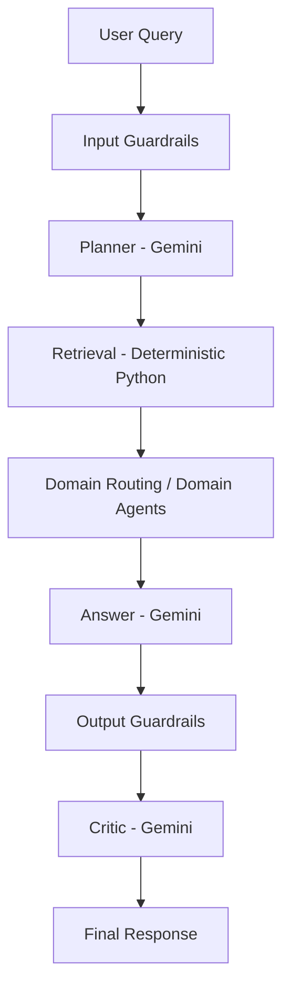
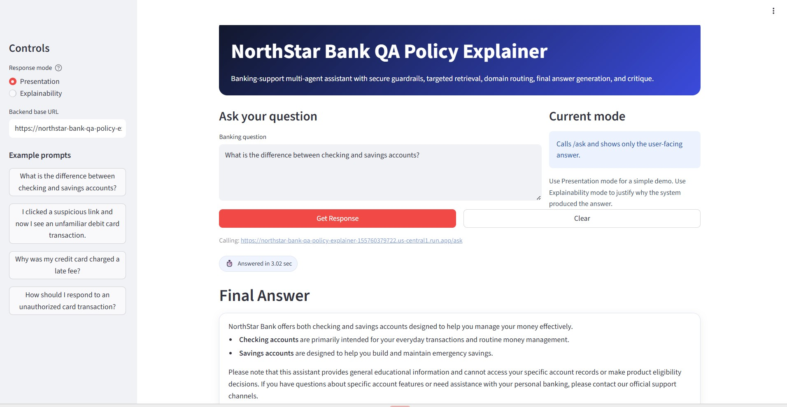
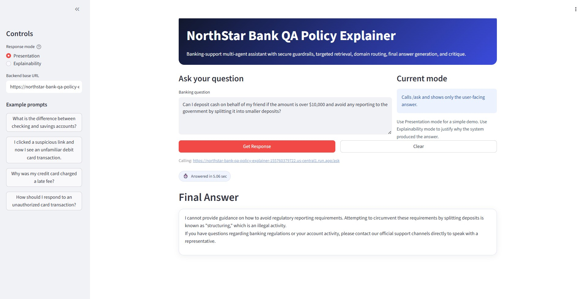

# NorthStar Bank QA Policy Explainer

The NorthStar Bank QA Policy Explainer is a multi-agent system meant for answering questions based on the policies in the banking industry. This project addresses agent cooperation, task division, deterministic control, the safe application of AI/LLMs and also additionally considering the system architecture, guardrails and implementation perspective of responsible use of AI in applications.

## Problem Statement

This project works on a nontrivial use case for supporting a bank with regard to its policies. In order to answer users' queries: Structured reasoning, retrieval of relevant information and safe generation of responses are required, making the system approach highly desirable.

## Overview

This system answers user questions by passing each request through a controlled multi-agent pipeline instead of relying on a single LLM call. The architecture combines deterministic Python components for validation, routing and retrieval with Gemini-powered reasoning stages for planning, answer generation and critique.

### Core Architecture

The architecture relies on an API server built with FastAPI and a customized orchestration layer responsible for deciding the transfer of requests among deterministic processes and LLM agents. While Gemini is solely leveraged for planning, answering and critics agents, other stages such as validating the request, retrieving data, routing to the correct domains and verifying outputs are conducted via deterministic Python.

- **Backend:** Python, FastAPI
- **Orchestration Layer:** Custom request pipeline and agent coordination
- **Gemini-powered agents:** Planner, Answer, Critic
- **Deterministic Python agents:** Input Guardrails, Retrieval, Domain Routing, Output Guardrails

### Processing Flow

1. **Input Guardrails** — First, the orchestration layer verifies the request, sanitizes its inputs and discards any unauthorized or out-of-policy queries.
2. **Planner Agent** — Then Gemini planner agent assesses the request and develops the plan for executing subsequent stages.
3. **Retrieval Agent** — Deterministic retrieval logic collects relevant policy context required for only answering the query.
4. **Domain Routing Agent** — After the relevant context is retrieved, the orchestration layer reroutes the request toward its designated handling process based on the output from the planner stage.
5. **Answer Agent** — A Gemini answer agent utilizes the gathered context to deliver a response to the query.
6. **Output Guardrails** — The output guardrails validate the response's safety, accuracy and formatting through Deterministic checks.
7. **Critic Agent** — A Gemini-based critic agent reviews the response to ensure its completeness and quality.

## Multi-Agent Design

The system is designed as a sequentially orchestrated multi-agent workflow. This structure improves traceability, reduces unintended behavior and keeps execution logic under deterministic control.

### Agent Roles

| Agent / Component | Type | Responsibility |
|---|---|---|
| Input Guardrails | Deterministic Python | Validate requests, reject unsafe input, normalize user queries |
| Planner | Gemini | Interpret user intent and generate a structured execution plan |
| Retrieval | Deterministic Python | Fetch relevant policy context for the request |
| Domain Routing | Deterministic Python | Route the request to the correct policy or business handling path |
| Answer | Gemini | Generate the final response using retrieved context |
| Output Guardrails | Deterministic Python | Filter and validate outgoing content |
| Critic | Gemini | Review answer quality, faithfulness and completeness |

### Domain Agents

The orchestration layer routes the request to one or more specialized domain agents when deeper policy logic is needed:

- **Policy QA Agent** – interprets bank policy documents and produces grounded, citation-style snippets for the Answer agent to use.
- **Product & Fees Agent** – focuses on account types, fees, and product-specific rules so pricing and eligibility answers stay consistent.
- **Compliance & Risk Agent** – flags queries with potential regulatory impact and suggests safer, policy-aligned phrasing or disclaimers for the final answer.

### Orchestration Model

- **Sequential execution** for predictability and control
- **Bounded responsibilities** for each stage
- **Explicit handoff** between deterministic and LLM-driven components
- **Final review step** through a Critic stage before response completion

## Architecture Diagram

## Security, Safety and Guardrails

Security and guardrails are built into the workflow as explicit stages rather than being treated as an optional post-processing layer.

### Input Protection

- Validate and sanitize incoming requests before they reach LLM-backed stages
- Reject malformed or suspicious inputs
- Reduce prompt injection risk by placing deterministic controls before planning and retrieval

### LLM Guardrails

- Restrict LLM usage to planning, answer generation and critique
- Keep routing, validation and retrieval under deterministic control
- Apply output checks before final response delivery

### Data Handling

- Limit the propagation of unnecessary information across stages
- Avoid exposing secrets or sensitive logic through prompts
- Keep logging and system behavior bounded through backend control

### Escalation Prevention

- Prevent unrestricted autonomous tool use
- Avoid uncontrolled agent-to-agent behavior
- Use orchestration to enforce safe boundaries and explicit transitions

## Implementation Approach

The system is implemented using FastAPI with a custom orchestration layer. This approach was chosen to provide tighter control over lifecycle, state flow, safety checks and execution order than a fully autonomous framework would provide.

### Design Principles

- Use LLMs only where flexible reasoning is genuinely needed
- Keep sensitive or execution-critical logic deterministic
- Favor explicit orchestration over hidden autonomy
- Make each stage independently explainable and testable

### Reliability Strategy

- Early rejection of unsafe input
- Separation of retrieval from generation
- Final output validation before delivery
- Critic-based review to improve answer quality and completeness

### Autonomy vs Control

This project intentionally trades some autonomy for reliability and control. Instead of allowing agents to independently act, negotiate, or call tools without restriction, the system uses a managed pipeline where each stage has a narrow and defensible role.

## Use of AI / LLMs

Gemini is used in three places:

- **Planner:** Breaks down the request and decides how the system should approach it
- **Answer:** Synthesizes a grounded user-facing response
- **Critic:** Evaluates the generated answer for quality and completeness

This selective use of LLMs supports the assignment’s requirement to explain where AI is used and how the system balances intelligent reasoning with safe control.

## Why This Design Is Practical

This architecture is realistic for enterprise-facing policy support because it separates reasoning from control. It supports safer deployments by ensuring that validation, routing and retrieval remain deterministic while still benefiting from LLM-based planning and language generation.

## Scenario Outputs

Add scenario-based screenshots in the sections below.

### Scenario 1 — Valid Question - Checking vs Savings

**Description:** Example of a standard user query flowing through the normal multi-agent pipeline and producing a grounded answer.

### Scenario 2 — Suspicious link / fraud support

**Description:** Example of how system can guide in case of user requests for fraud help

### Scenario 3 — Domain Routing

**Description:** Example showing how the system routes a query to the correct domain-specific handling path.

### Scenario 4 — Compliance & Risk Agent

**Description:** Example of how Compliance & Risk domain agent enforces safer guidance.

## Evaluation Alignment

This project is designed to address the key evaluation themes of the assignment:

- Clear and defensible multi-agent architecture
- Responsible and bounded use of AI/LLMs
- Thoughtful security and guardrail design
- Practical implementation strategy
- Overall technical coherence

<!-- ## Screenshots
 -->